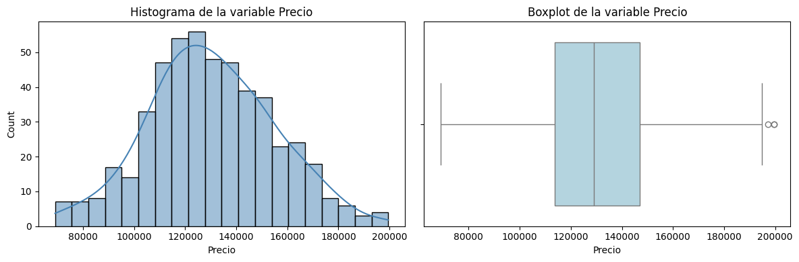
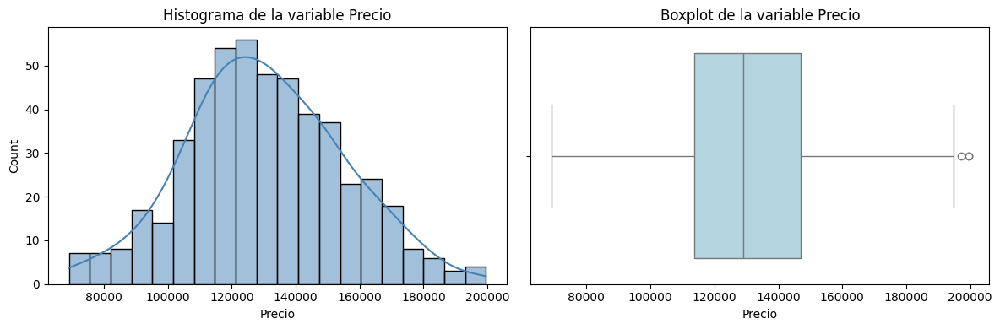
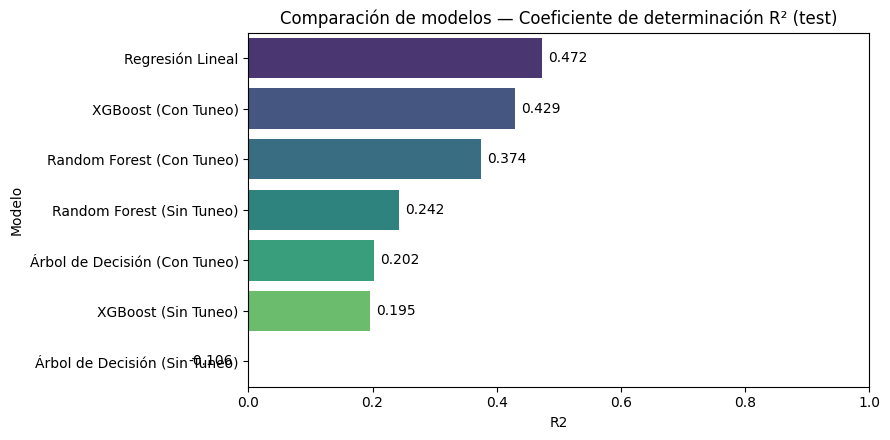
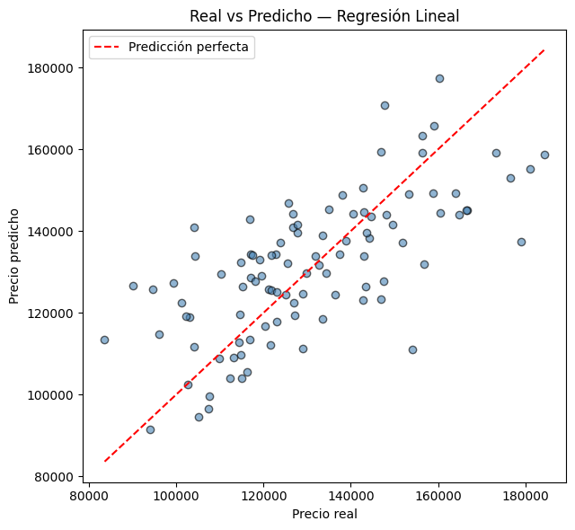
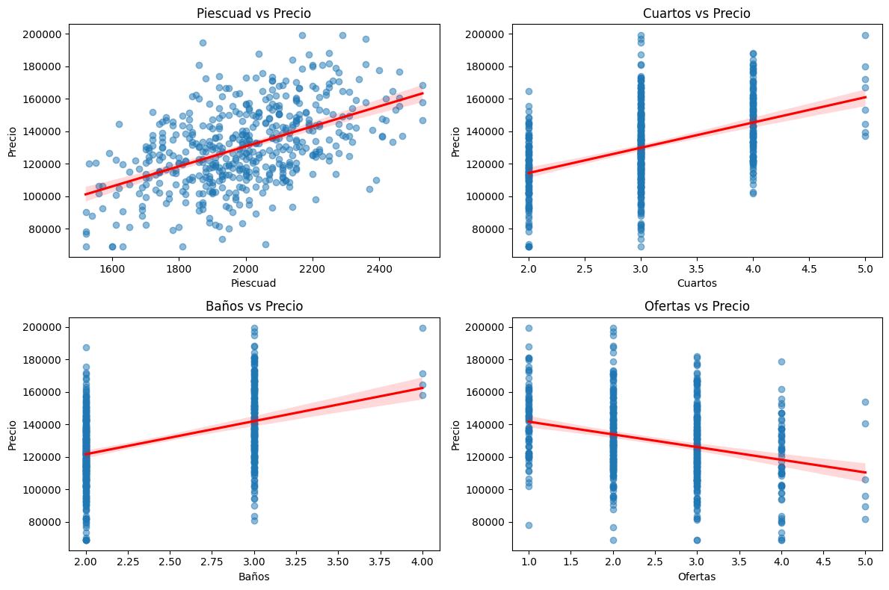

# 🏠 Estimación del Precio de Viviendas en Lima Metropolitana

[](https://colab.research.google.com/github/Abdielkun/t4_machine_learning/blob/main/ProyectoFinal_PrecioViviendas.ipynb)


Proyecto final del curso de **Sistemas Inteligentes y Machine Learning** — Universidad Tecnológica del Perú (2026).

Aplicación de modelos de regresión sobre características físicas de inmuebles para estimar su precio óptimo de venta en el mercado de Lima Metropolitana.

## 📌 Contexto

La fijación de precios inmobiliarios suele apoyarse en tasaciones manuales e intuitivas que no escalan y aumentan el riesgo financiero. Este proyecto usa algoritmos predictivos para cuantificar cómo influye cada característica del inmueble (área, cuartos, baños) y el nivel de competencia local en el precio final.

## 🎯 Objetivo

Desarrollar un modelo de machine learning de regresión para estimar el precio óptimo de viviendas en función de sus atributos físicos y la competencia local, siguiendo la metodología **CRISP-DM**.

## 🧪 Metodología

1. **Comprensión del negocio** — necesidades del mercado limeño.
2. **Datos** — EDA de 500 registros (121 reales + 379 sintéticos con la misma estructura de covarianza).
3. **Preparación** — normalización (`StandardScaler`) e ingeniería de variables (`Area_x_Cuarto`, `Ratio_Banos_Cuartos`).
4. **Modelado** — entrenamiento y optimización (`GridSearchCV`) de 4 algoritmos.
5. **Evaluación** — validación cruzada, métricas R² y MAE.

## 📊 Dataset

| Variable | Descripción | Tipo | Rango |
|---|---|---|---|
| Piescuad | Superficie total (sqft) | int64 | 1,500 – 2,500 |
| Cuartos | N° de dormitorios | int64 | 2 – 5 |
| Baños | N° de baños completos | int64 | 2 – 4 |
| Ofertas | Viviendas competidoras en la zona | int64 | 1 – 5 |
| **Precio** (target) | Precio final de venta (USD) | int64 | $69,100 – $199,500 |

## 🤖 Modelos comparados

| Modelo | R² (test) |
|---|---|
| **Regresión Lineal Múltiple** 🏆 | **0.472** |
| XGBoost (con tuneo) | 0.429 |
| Random Forest (con tuneo) | 0.374 |
| Árbol de Decisión (con tuneo) | 0.202 |

La Regresión Lineal obtuvo el mejor desempeño (R²=0.472, RMSE=$15,909, MAE=$12,744), indicando que la relación entre variables y precio es predominantemente lineal en este dataset.

**Ecuación final:**
```
Precio = 130185.25 + 14394.4·Piescuad − 14394.2·Ofertas + 5685.3·Baños + ...
```

## 📈 Resultados y Visualizaciones

<table>
<tr>
<td width="50%">

**Matriz de correlación**


</td>
<td width="50%">

**Distribución del precio**


</td>
</tr>
<tr>
<td width="50%">

**Comparación de modelos (R²)**


</td>
<td width="50%">

**Precio real vs. predicho**


</td>
</tr>
<tr>
<td width="50%">

**Dispersión de residuos**


</td>
<td width="50%">

**Distribución de residuos**


</td>
</tr>
</table>

<details>
<summary>Ver más gráficos (boxplot, pairplot, relación área-precio)</summary>





</details>

## 📁 Contenido del repositorio

- `ProyectoFinal_PrecioViviendas.ipynb` — notebook completo (EDA, feature engineering, entrenamiento y evaluación de modelos).
- `DataPrecioVivienda_Aumentado.xlsx` — dataset utilizado.
- `assets/` — gráficas exportadas del notebook (usadas en este README).
- `docs/` — informe final en PDF/Word.

## 👥 Autores

J. Castro • K. Yarihuaman • X. Camarena • J. Ramos • A. Calderon
Grupo 5 — Sistemas Inteligentes y Machine Learning
